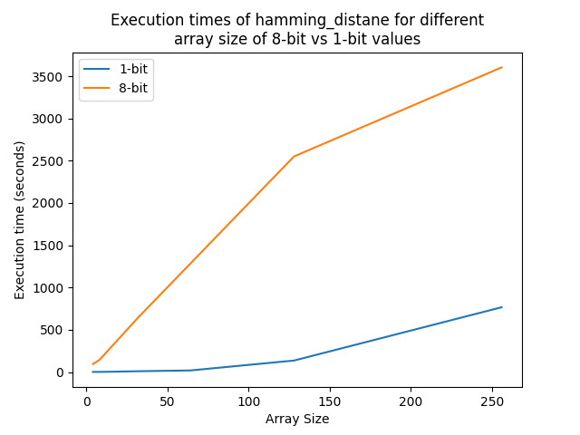

# FHE Biometrics
## Introduction

Biometric recognition has emerged as a prominent method for user authentication and identity verification. With the increasing importance of protecting biometric information during storage and transfer, there is a need for secure and efficient solutions. This report outlines the development and implementation of a remote authentication system using Fully Homomorphic Encryption (FHE) and biometric template protection (BTP) techniques.

## Project Overview

The objective of this project was to design an FHE-based remote authentication system that ensures the secrecy, irreversibility, and renewability of sensitive Iris biometric information during storage and biometric comparison. The project utilized Zama libraries, specifically the Concrete Python library, to implement a single key TFHE-based BTP for an access control system.

## Implementation Details

The project was implemented in a client-server architecture, with the client responsible for collecting the iris biometric, extracting the feature vector, encrypting it using FHE, and sending it to the server. The server, on the other hand, performed the comparison against its encrypted database, and returned an encrypted matching ID or a "no match" encrypted message to the client. The system aimed to achieve an Equal Error Rate (EER) of 0.1% using the CASIA-IRIS database for computing error rates.

### Client Implementation

The initial client implementation was based on TFHE-rs library in Rust. However, after discussions with the Zama team, it was decided to switch to the Concrete Python library for its compatibility and ease of use. The client implementation involved the following steps:

- Collecting the iris biometric in the format specified by CASIA-IRIS.
- Extracting the feature vector from the iris biometric.
- Encrypting the feature vector using FHE with Concrete Python.
- Sending the encrypted feature vector to the server for comparison.

### Server Implementation (WIP)

The server was developed using FastAPI, a modern, fast, web framework for building APIs with Python. The server implementation included the following key components:

- FastAPI Documentation: Detailed documentation was created to provide clear instructions on how to use the server API.
- Background Jobs: As the comparison process might be time-consuming, background jobs were implemented to perform the biometric comparisons asynchronously, ensuring efficient processing.
- Server Architecture: The server architecture was designed to handle multiple client requests concurrently and securely store the encrypted reference templates in the database.

## Algorithm Development and Optimization

To align the implementation with the research paper "Hybrid biometric template protection: Resolving the agony of choice between bloom filters and homomorphic encryption," the team thoroughly studied the concepts and methodologies outlined in the paper. The implementation steps involved:

- Reproducing the results from the paper by compiling and running the provided code.
- Comparing the results with the Python implementation using numpy.
- Adapting the code to be compatible with Concrete Python and utilizing only supported operations.
- Profiling the implementation to identify performance bottlenecks and optimize the execution time.

### Optimization Techniques

To improve the performance of the biometric identification process, two optimization techniques were applied:

- Active Points Selection: By considering only active points from the image, the input size was reduced from approximately 200,000 to 1,500, resolving the issue of code crashes when using real iris data.
- Bit-level Representation: Leveraging the fact that the iris images are black and white, the implementation used 1-bit values instead of 8-bit values. This optimization resulted in a significant improvement in execution time, achieving a threefold speedup.

Tests were done to make sure the comparison score is good enough after every optimization step.

## Results and Evaluation

The implemented FHE-based remote authentication system demonstrated successful functionality and achieved most of the project's objectives. The system effectively protected sensitive iris information during storage and biometric comparison, utilizing the CASIA-IRIS database

## Conclusion

In conclusion, this project successfully implemented a remote authentication system using Fully Homomorphic Encryption (FHE) and biometric template protection (BTP) techniques. The utilization of Zama libraries, specifically the Concrete Python library, provided a streamlined and efficient implementation process. Through algorithm development, optimization techniques, and serialization methods, the system achieved secure and reliable iris biometric identification. Further improvements and real-world deployment considerations should be explored to enhance the system's usability and scalability specifically execution time which is crucial to authentication systems.

## Perseptives

- Make sure the system achieved an Equal Error Rate (EER) of 0.1%, meeting the specified requirements.
- Finalize the server implementation
- Find other optmization techniques to make the solutions more usable by bringing the execution time further down

## Acknowledgments

We would like to express our gratitude to the Zama team for their support and guidance throughout the project. Their expertise and collaboration were instrumental in the successful implementation of the FHE-based remote authentication system.

## References

[Resolving the agony of choice between bloom filters and homomorphic encryption](https://ietresearch.onlinelibrary.wiley.com/doi/10.1049/bme2.12075)
